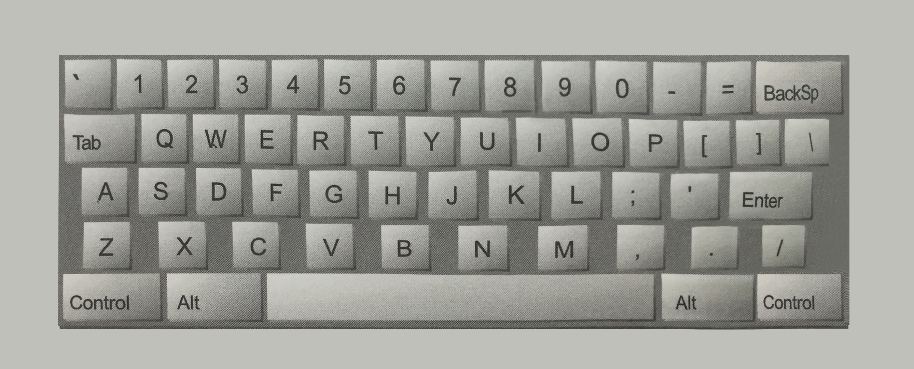

### Algorithm test - 2
#### QWERTY
타이핑을 하다 보면 키보드에서 양손을 모두 원래 위치보다 오른쪽으로 한 칸 이동한 상태에서 키를 눌러서 오타가 나오는 경우가 종종 있다. 그러면 q는 w j는 k같은 식으로 오른쪽에 있는 키가 입력된다. 이런 식으로 입력된 메세지가 주어졌을 때 원래 메세지로 복구시켜야 하는 임무가 주어졌다.

#### 입력
* 입력은 여러 줄의 텍스트로 구성된다. 
* 각 줄에는 숫자, 스페이스, 대문자(Q, A, Z 제외), 위에 나와있는 구두 기호(역따옴표()제외)가 들어갈 수 있다. 
* 단어가 붙어있는 키(Tab, BackSp, Control등)는 입력에 들어있지 않다.   

#### 출력
* 위에 나와있는 QWERTY 키보드를 기준으로 하여 각 글자나 기호를 바로 왼쪽에 있는 키에 해당하는 글자나 기호로 바꿔야 한다.
* 입력에 있는 스페이스는 그대로 둔다.

#### 입력 예
> O S, GOMR YPFSU/  
> QWFDG ER ERTFDG  
> fsjdkl sd errw    

#### 출력 예
> I AM FINE TODAY.  
> ValueError  
> ValueError   
